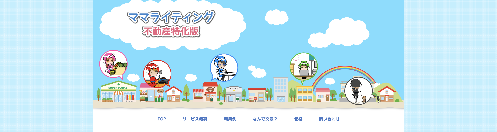

# HTML_BEGINNER

## 前振り（フィクション）

弊社は既存サービス「ママライティング」を不動産分野に事業拡大したい。そこで新たな顧客獲得のための Web ページを作成することになった。  
不動産分野の顧客は Web 操作に慣れていないひとも多いため、**正統派デザイン**だけでなく「**IE 対応**」や「**スマホ対応**」が欠かせない。  
弊社では Web サイトのデザイン業務を主婦の方に依頼しており、PDF などで入稿されたモックアップデータを社内のコーダーが実際の HTML などに起こしていく流れを取っている。

あ、そうそう、今回から Web 制作業務を君たち大学生アルバイトに任せることになったよ。よろしく。**わからないことがあったら何でも聞いてね！**

## 章の目的

- まずは Web に触れてみる！
- 基本的な HTML タグを理解する  
  ただ覚えるだけでなく、タグの役割なども気にしつつ作ってみる。
- 基本的な css を理解する  
  難しいプロパティはともかく、配置・サイズ関連など頻出なものはパパッとかけると良いね。
- わからないことは何でも、調べてみたり会社のひとに聞いてみる。  
  （フィクションなので会社のひと＝出題者ですが...）

# HTML_BEGINNER_001

## 仕様書

### モックアップイメージ

**完成形イメージ１**  

**完成形イメージ２（狭いウインドウの時）**  

**完成形イメージ３（リンクにカーソルをあわせた時）**  

### 仕様情報

- コンテンツ幅: 最大 1280px
- メニュー幅: 最大 768px
- テーマカラー（青色部分）: `#5078c8`
- ポイントカラー（橙色部分）: `#ff9b00`

### 構成ファイル

- **./css/style.css**  
  css デザインはここに記述します。
- **./imgs/pattern.png**
- 背景素材です。**30px 四方で調整してあります**ので、そのように設定して使ってください。
- **./img/TOP.png**  
  TOP の挿絵です。h1 タグ内に設定して欲しいのですが、SEO 対策で画像に「 」と、テキストも設定してください。
- **index.html**  
  Web ページの本体ファイルです。

## 本節の課題

サイトを作るにあたって、サイトの TOP 部分にあたる「ヘッダー」を作りながら基本の**横配置**を習得する。

想定される PC 画面サイズは、横幅 960px〜1920px である。全ての状態についてきれいに表示されるようにデザインを行う。ただしレスポンシブデザイン（スマートフォン対応）は任意とする。

### 流れ

1.  HTML ファイルを編集

    - パスがおかしかったり空の部分があるので修正
    - クラス名が欠けているので設定  
      クラス名の命名方法例：[BEM](https://tech-dig.jp/bem-css-html/)

2.  css ファイルにスタイルを設定
    - 背景素材の貼り方  
      ループさせたりサイズを指定したり...。
    - **メディアクエリ**は使わずにコンテンツ幅をうまく設定してみる  
      ヒント：`width`と`max-width`プロパティ

### 目標到達点[顧客部門]

- 中央 1280px にコンテンツが表示される
- 1280px を超える外側については背景画像が設定されている
- 画面横幅が 1280px を下回ったときも正しく挙動する
- メニューが横並びになっている
- テーマカラーが正しく使われている

### 目標到達点[技術部門]

- 適切なクラス名を付けられている
- CSS によるデザインは全て`./css/style.css`に記述されている
- スタイルは全て**クラス**に紐付いている
- `float: left`を用いていない

# 制作

**Kohei Seta**  
E-mail: kohei.s@wannagrow.co.jp

Copyright &copy; 2019 WANNAGROW Inc. All Rights Reserved.
